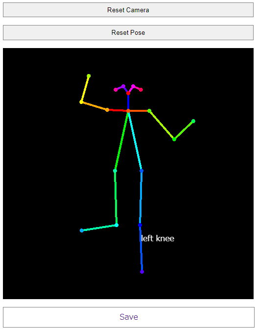

# Posex - Estimated Image Generator for Pose2Image

## How to use

```
$ pip install -r requirements.txt
$ python app.py
```

Then open `localhost:55502` or `127.0.0.1:55502` in your browser.



## v0.1 -> v0.2 features
- copying the image to clipboard
- multiple bodies
- canvas size changing
- UI has become ugly >_<;
